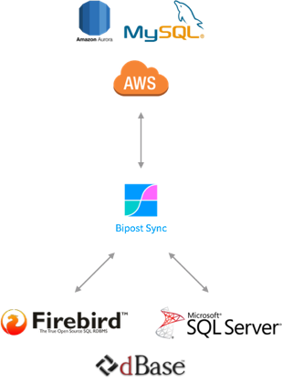
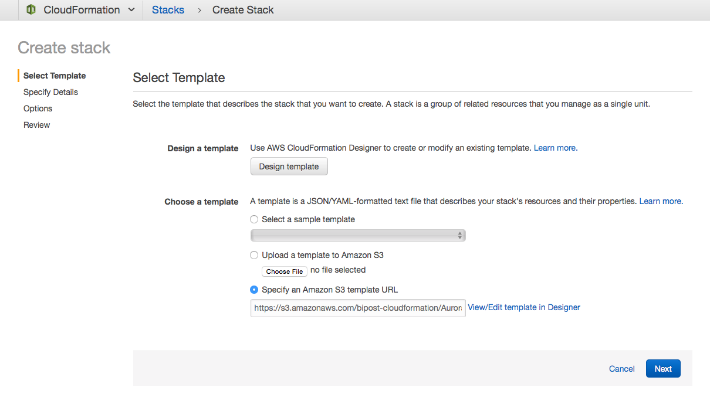
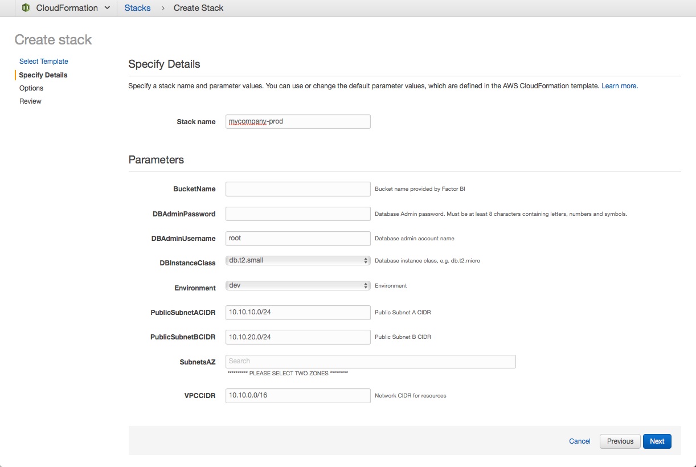
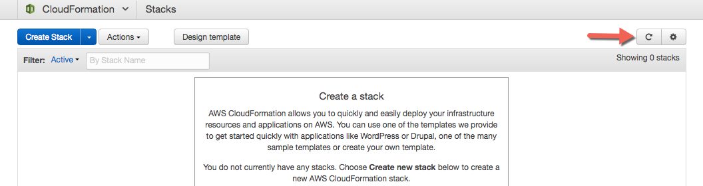
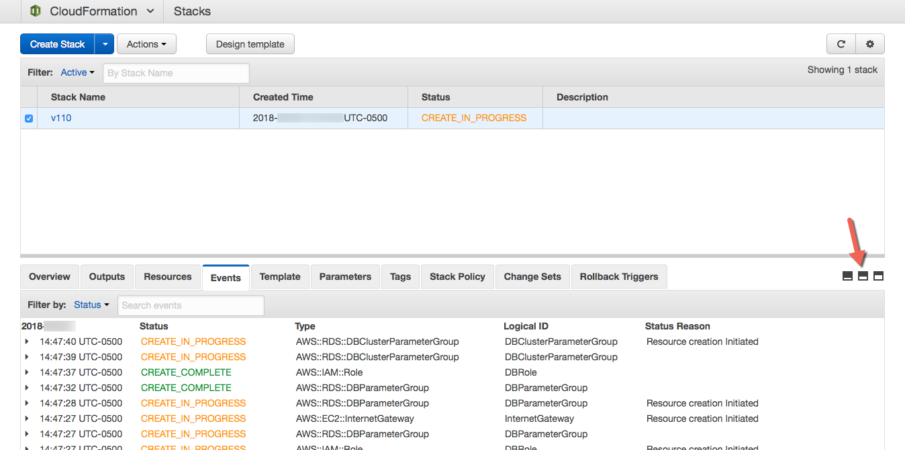

# Bipost
Bipost is a simple database synchronization tool for continually moving data from on-premises to AWS Aurora MySQL and back forward.
Created to keep your Windows databases on-premises while providing a way to extract, load & transform specific sets of data to AWS Aurora.

**Sources:**

* [Microsoft SQL Server®](http://www.microsoft.com/en-us/sql-server)
* [Firebird SQL](https://firebirdsql.org/)
* [DBF dBase III](http://www.independent-software.com/dbase-dbf-dbt-file-format.html)

**Destination:**

* [Amazon Aurora MySQL](https://aws.amazon.com/rds/aurora/details/mysql-details/)

# Link your AWS Account to Bipost API

This CloudFormation template will link your AWS Account to Bipost API.
*A CloudFormation template is an automated script to create and configure AWS resources.*

These instructions assume that you already have:
1. An active AWS account.
2. Sent to [info@factorbi.com](mailto:info@factorbi.com) your **AWS Account ID** and **Canonical User ID.**
3. Received from Factor BI your **bucket name.**

If you are not sure about these requirements please visit the [documentation page.](https://factorbi.github.io/)

## Run the script

### Before you start
1. Have at hand your **bucket name.** It must look like this: `bipostdata-123456789012`
2. Log in to your AWS account.

**IMPORTANT NOTICE: Many settings used here are for testing purposes. If you are planning to use the following AWS services for production you may want to follow your company policies and understand how to use AWS security according to your needs.**

### 1. Launch the Stack

Select the closest region to your location and click **Launch Stack.**

| AWS Region | Short name | |
| -- | -- | -- |
| US East (N. Virginia) | us-east-1 |  |
| US East (Ohio) | us-east-2 |  |
| US West (California) | us-west-1 |  |
| US West (Oregon) | us-west-2 |  |
| Canada (Central) | ca-central-1 |  |
| Europe (Ireland) | eu-west-1 |  |
| Europe (London) | eu-west-2 |  |
| Europe (Frankfurt) | eu-central-1 |  |
| Europe (Paris) | eu-west-3 |  |
| Asia Pacific (Mumbai) | ap-south-1 |   |
| Asia Pacific (Seoul) | ap-northeast-2 |  |
| Asia Pacific (Singapore) | ap-southeast-1 |  |
| Asia Pacific (Sydney) | ap-southeast-2 |  |
| Asia Pacific (Tokyo) | ap-northeast-1 |  |
| South America (São Paulo) | sa-east-1 |   |

### 2. Select Template

* The template must be already selected, click **Next** lower-right blue button.

### 3. Specify Details
* **Stack Name:** this will be the prefix of all provisioned services.  Example: `mycompany-prod`
* **BucketName:** Paste the S3 bucket name that your received from Factor BI over email. It must look like this: `bipostdata-123456789012`
* **DBAdminPassword:** Type a complex password. Must be at least 8 characters containing uppercase and lowercase letters, numbers and symbols.
    **Password must be at least eight characters long, as in "mypassword". Can be any printable ASCII character except "/", """, or "@".**

* **DBAdminUsername:** Database Admin Username, example: root
* **DBInstanceClass:** for testing purposes select the smallest available, currently db.t2.small.
* **Environment:** Text to be included in the database cluster name.
* **PublicSubnetACIDR:** Leave default. Only modify the subnet address if multiple environments are needed, example: `10.20.10.0/24`
* **PublicSubnetBCIDR:** Leave default. Only modify the subnet address if multiple environments are needed, example: `10.20.20.0/24`
* **SubnetsAZ:** Select two availability zones to create the resources.
* **VPCCIDR:** Leave default. Only modify the address if multiple environment are needed, example: `10.20.0.0/16`
* Click **Next**, blue button blue button.

### 4. Options
* Leave all defaults, many in blank.
* Click **Next**, blue button blue button (lower-right).

### 5. Review

* Check "I acknowledge that AWS CloudFormation might create IAM resources with custom names".

* Click **Create** blue button. This will redirect to CloudFormation console home.
* Click refresh icon, upper right corner.

### 6. Resources created

* Check Stack Name.
* Review **Events** tab while Status is CREATE_IN_PROGRESS.
* Once Status is CREATE_COMPLETE review **Outputs** tab.
* You may want to copy and save on a secure place all Outputs, as you will use them for further configuration.

## License

Licensed under [MIT License.](LICENSE.md)
